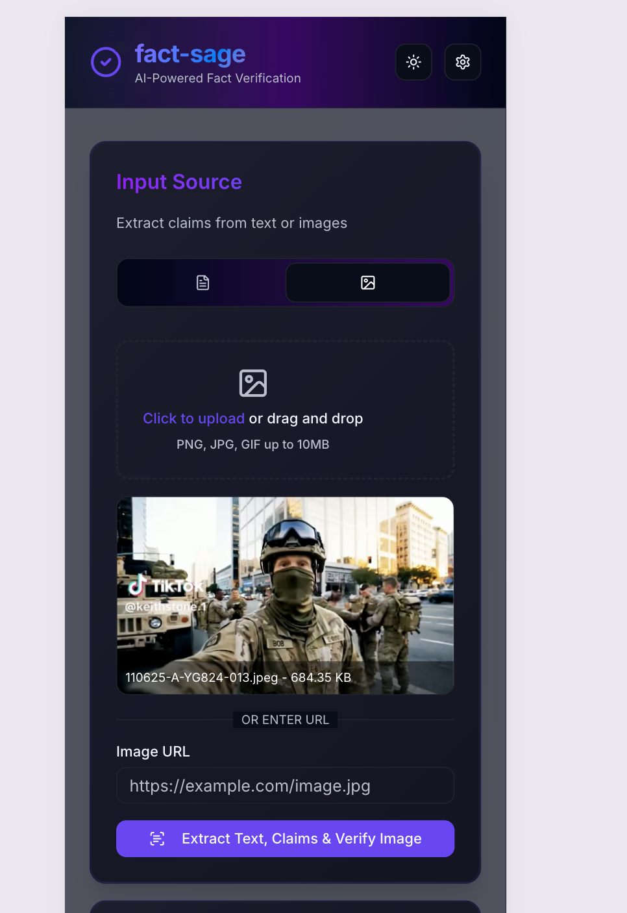
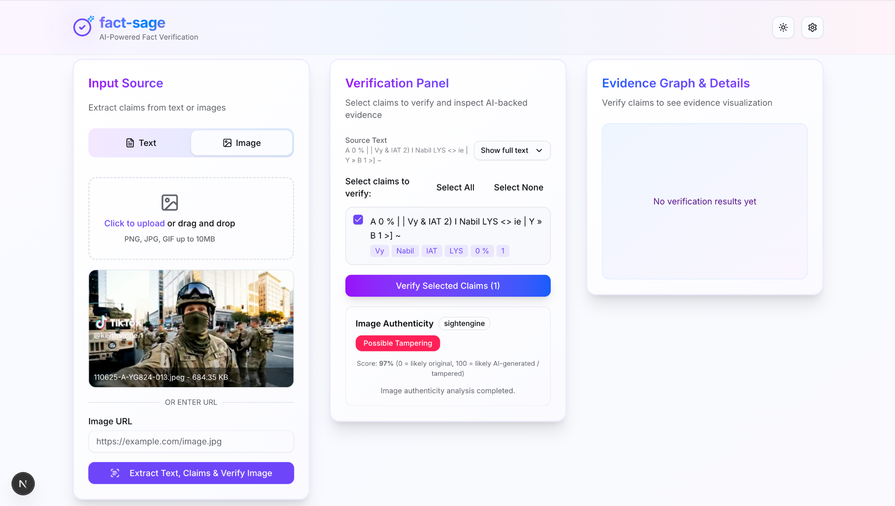
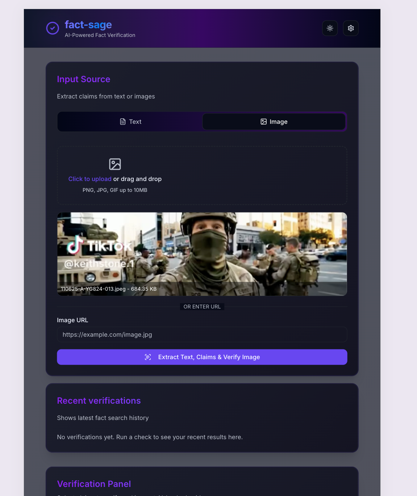
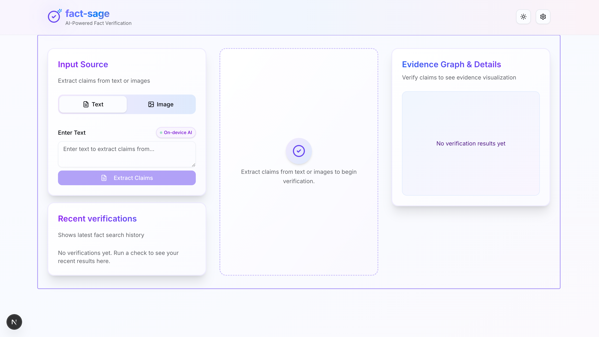
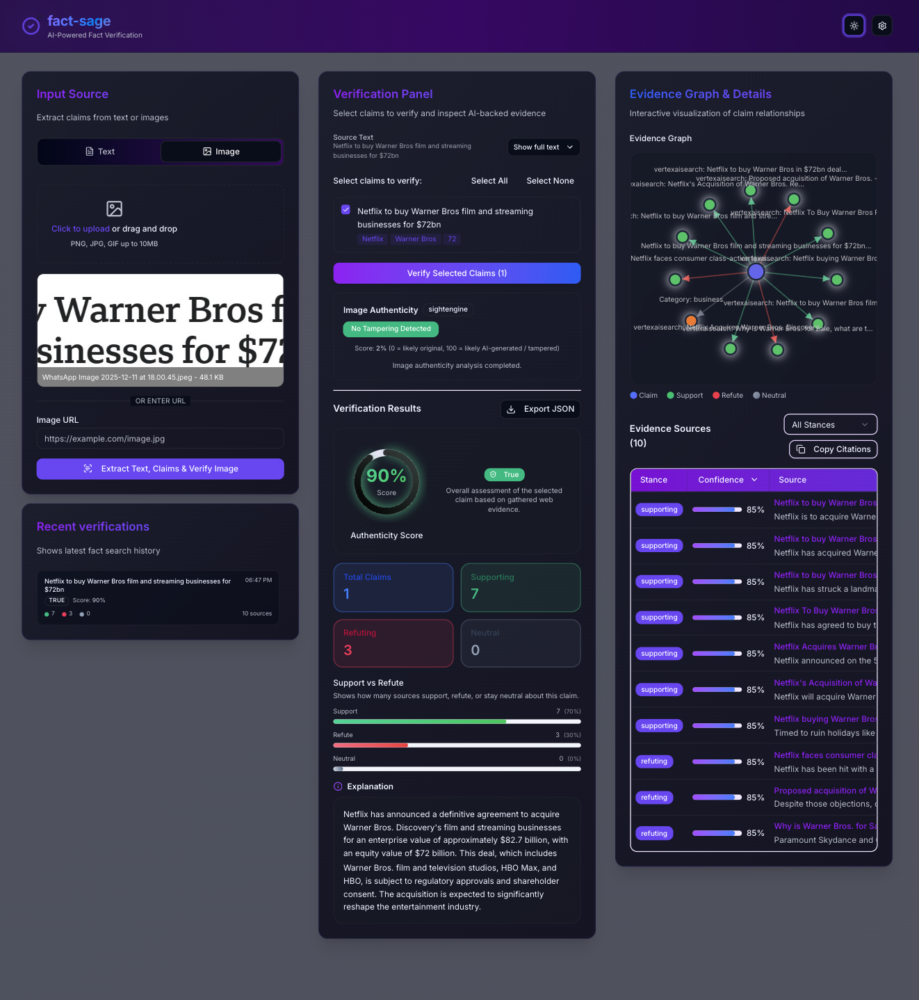
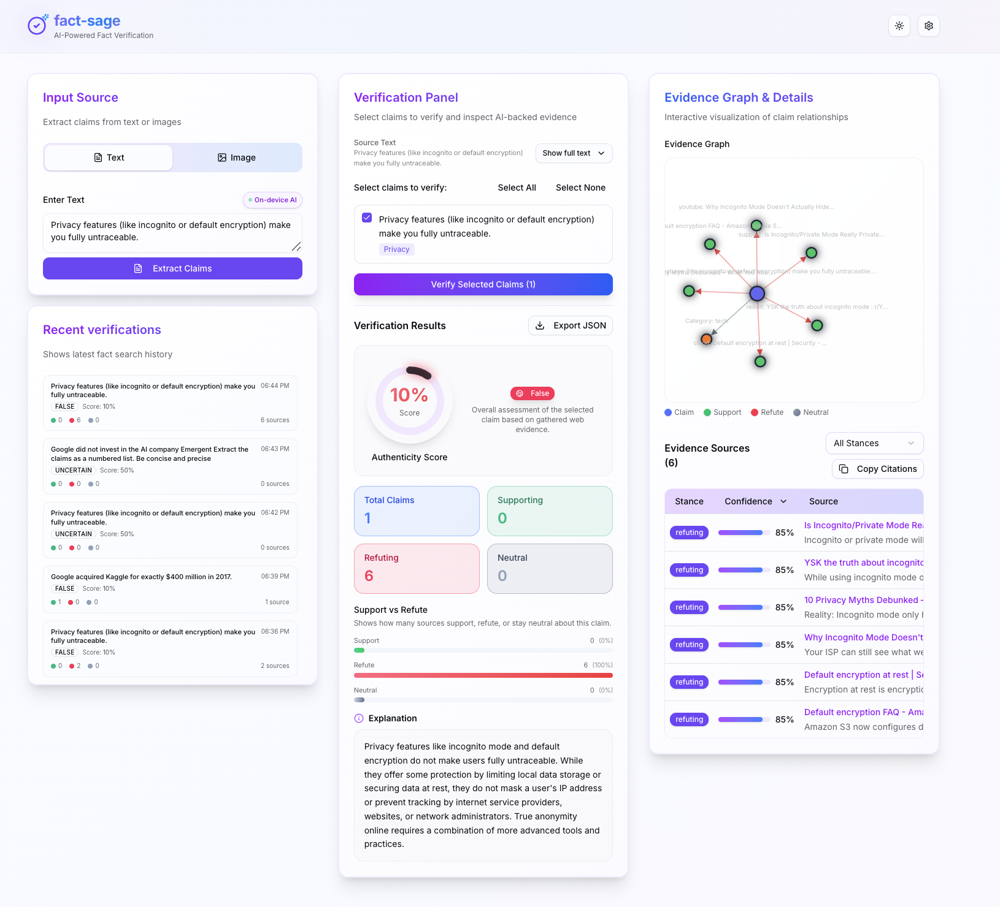

<div align="center">

# 🔍 FactSage

### AI-Powered Fact-Checking Platform

*Verify claims instantly with Google Search + Gemini AI*

[](https://nextjs.org/)
[](https://www.typescriptlang.org/)
[](https://ai.google.dev/)
[](LICENSE)

[Demo](#-demo) • [Features](#-features) • [Quick Start](#-quick-start) • [Documentation](#-documentation)

</div>

---

## 🌟 Overview

**FactSage** is an intelligent fact-checking application that combines OCR text extraction, AI-powered claim analysis, and real-time Google Search verification to help you verify information accuracy in seconds.

### Why FactSage?

- 🚀 **3-8 second verification** using Gemini AI + Google Search  
- 📸 **OCR support** for images, and screenshots  
- 🎯 **High-accuracy verification** via multi-source reasoning  
- 🔗 **Source attribution** with supporting & refuting evidence  
- 📊 **Interactive knowledge graph** with evidence relationships  
- 🧭 **Recent history panel** for comparing past verifications  
- ♿ **Accessibility-first UX** (skip link, keyboard navigation, ARIA roles)

---

## ✨ Features

### 🤖 AI-Powered Verification
- **Gemini 1.5 Flash** with Google Search grounding  
- On-device **claim extraction** using lightweight AI models  
- Automatic **query generation** for optimized web search  
- Structured **verdict** with **confidence score & explanation**

### 📰 Multi-Source Analysis
- Fetches 5–15 reputable sources automatically  
- Categorizes evidence as **supporting**, **refuting**, or **neutral**  
- Displays **citations** with URLs and context snippets  
- Highlights **entity matches** and keyword alignment

### 📸 OCR & PDF Support
- Image upload + drag-and-drop support  
- Screenshot-to-text via **Tesseract.js**  
- PNG conversion for consistent OCR accuracy  
- URL ingestion with client-side preview  
- **Cached OCR worker** for faster repeated extraction

### 📊 Visual Knowledge Graph
- Interactive D3 graph visualization  
- Clickable evidence nodes that open source URLs  
- Keyboard-accessible graph navigation (ARIA-friendly)  
- Lazy-loaded graph for performance optimization

### 🧭 Verification History Panel
- Stores last **5 verifications** automatically  
- Shows claim, verdict, and confidence score  
- Displays evidence stance counts (support/neutral/refute)
- Lightweight implementation with accessibility in mind

### 🔧 Developer-Friendly
- TypeScript + Next.js App Router  
- Hybrid UI stack: **Shadcn/UI + MUI + Tailwind**  
- **React Hook Form + Zod** for validation  
- Dynamic imports for large components  
- Modular architecture with clear separation of concerns

---

## 🚀 Quick Start

### Prerequisites

- **Node.js 18+**
- **npm** or **yarn**
- **Gemini API Key** ([Get one free](https://aistudio.google.com/app/apikey))

### Installation

```bash
# Clone the repository
git clone https://github.com/kashishdesai01/CMPE-280-FactSage.git

# Install dependencies
npm install

# Set up environment variables
cp .env.example .env.local
```

### Configuration

Edit `.env.local`:

```bash
# Required: Gemini API Key
GEMINI_API_KEY=your_api_key_here

# Optional: For development
NODE_ENV=development
```

### Run Development Server

```bash
npm run dev
```

Visit **http://localhost:3000** 🎉

---

## 📖 Usage

### Basic Claim Verification

```typescript
// POST /api/verify-claim
{
  "text": "Intel posted $4.1B profit in Q3 2024"
}
```

### Response Format

```json
{
  "authenticity_score": 0.9,
  "verdict": "true",
  "category": "tech",
  "evidence": [
    {
      "url": "https://cnbc.com/2024/intel-earnings",
      "title": "Intel Reports Strong Q3 Results",
      "snippet": "Intel announced Q3 profit of $4.1 billion...",
      "stance": "supporting",
      "confidence": 0.85
    }
  ],
  "explanation": "Multiple sources confirm Intel's Q3 profit...",
  "graph": { "nodes": [...], "edges": [...] }
}
```

---

## 🏗️ Architecture

```
┌─────────────────┐
│   User Input    │  (Text / OCR Image)
└────────┬────────┘
         │
         ▼
┌────────────────────────────────────────┐
│ Claim Extractor (LLM + On-device AI)   │
│ - OCR (Tesseract.js Worker)            │
│ - Text cleanup + entity detection      │
└────────┬───────────────────────────────┘
         │
         ▼
┌─────────────────────────────────────────┐
│ Gemini Verifier (Google Search + LLM)   │
│ - Category detection                    │
│ - Query generation                      │
│ - Fetch 5–15 sources                    │
│ - Evidence scoring + stance             │
│ - Verdict + explanation generation      │
└────────┬────────────────────────────────┘
         │
         ▼
┌──────────────────────────────────┐
│ Structured JSON Output           │
│ - Evidence array                 │
│ - Verdict + confidence           │
│ - Knowledge graph nodes/edges    │
│ - Stance classification          │
└──────────────────────────────────┘
```

---

## 🛠️ Tech Stack

| Technology                  | Purpose                      |
| --------------------------- | ---------------------------- |
| **Next.js 14 (App Router)** | Main framework               |
| **TypeScript**              | Type-safe development        |
| **Gemini 1.5 Flash**        | AI reasoning + verification  |
| **Google Search API**       | Real-time grounding          |
| **Tesseract.js**            | OCR for images               |
| **Tailwind CSS**            | Layout + utility styling     |
| **Shadcn/UI + MUI**         | Components & accessible UI   |
| **Zod + RHF**               | Strong form validation       |
| **D3.js**                   | Evidence graph visualization |

---

## 📁 Project Structure

```
factsage/
├── app/
│   ├── api/
│   │   ├── verify-claim/
│   │   │   └── route.ts             # Main verification endpoint
│   │   ├── ingest/
│   │   ├── image-verify/
│   ├── page.tsx                     # Home page
│   ├── layout.tsx
│   └── globals.css
├── components/
│   ├── input-panel.tsx
│   ├── text-input.tsx
│   ├── image-input.tsx
│   ├── verification-panel.tsx
│   ├── evidence-panel.tsx
│   ├── evidence-graph.tsx
│   ├── results-history-panel.tsx
│   └── ui/...
├── lib/
│   ├── gemini-verifier.ts           # Gemini AI integration
│   ├── claim-extractor.ts           # LLM claim extraction
│   ├── types.ts                     # TypeScript definitions 
│   ├── utils.ts
│   └── image-utils.ts
└── public/
├── .env.local                       # Environment variables
├── package.json
└── README.md
```

---

## 🎯 API Endpoints

### `POST /api/verify-claim`

Verify a factual claim using AI + Google Search.

**Request Body:**
```json
{
  "text": "Your claim here"
}
```

**Response:**
- `authenticity_score`: 0.0-1.0 confidence
- `verdict`: `true`, `false`, `mixed`, or `uncertain`
- `category`: Auto-detected category
- `evidence`: Array of sources with stance
- `graph`: Knowledge graph visualization data
- `explanation`: Human-readable summary

---

## 🧪 Testing

```bash
# Run unit tests
npm test

# Test API endpoint (For manual check)
curl -X POST http://localhost:3000/api/verify-claim \
  -H "Content-Type: application/json" \
  -d '{"text":"The earth is round"}'
```

---
## ♿ Accessibility

- Follows WCAG 2.1+ guidelines
- Provides a skip link for keyboard users
- Uses ARIA roles and labels on the interactive graph
- Includes an `aria-live` region for verification status updates
- Supports full keyboard navigation for all controls
- Uses high-contrast, colorblind-safe design
- Tested with Lighthouse (Accessibility score ≥ 95)

## ⚡ Performance Highlights

- Lazy-loads heavy components (e.g., D3-based graph)
- Caches the Tesseract OCR worker for 3–5× faster subsequent OCR
- Uses React memoization for KPI and evidence components
- Reduces bundle weight and improves Time to Interactive (TTI)

---

## 🔐 API Limits

**Gemini Free Tier:**
- ✅ 20 requests/day
- ✅ No credit card required

**Cost (Paid Tier):**
- 💰 ~$0.001 per verification
- 💰 ~$1 per 1,000 verifications

---

## 🤝 Contributing

We welcome contributions! Please follow these steps:

1. Fork the repository
2. Create a feature branch (`git checkout -b feature/AmazingFeature`)
3. Commit your changes (`git commit -m 'Add AmazingFeature'`)
4. Push to branch (`git push origin feature/AmazingFeature`)
5. Open a Pull Request

### Development Guidelines

- Follow TypeScript best practices
- Add tests for new features
- Update documentation
- Use meaningful commit messages

## 🙏 Acknowledgments

- **Google Gemini**
- **Tesseract.js**
- **Next.js** & **Vercel**
- **Shadcn/UI** & **MUI**

## 🗺️ Roadmap

- [x] Gemini AI integration
- [x] OCR text extraction
- [x] Interactive knowledge graph
- [x] Verification history panel
- [x] Accessibility improvements
- [x] Historical claim tracking
- [ ] Multi-language support
- [ ] Browser extension
- [ ] Mobile app (React Native)
- [ ] Custom source prioritization
- [ ] Collaborative fact-checking

## 📸 UI Showcase (Screenshots & Responsive Layouts)

FactSage is designed to be fully responsive and accessible across mobile, tablet, and desktop breakpoints.  
Below is a showcase of key screens, input modes, and verification flows.

---

### 📱 Mobile View — Image Upload & OCR Workflow
Displays the image upload interface, preview panel, and extraction workflow optimized for narrow screens.



---

### 🖼️ OCR Image Preview (Auto-Extraction)
Uploaded images are displayed with metadata before verification begins.



---

### 📱 Tablet / Responsive Layout (iPad View)

Demonstrates how FactSage adapts to medium screen sizes with adjusted spacing, stacked panels, and responsive evidence graph rendering.



---

### 💻 Desktop Layout — Input + Verification Panels
Three-column responsive layout showing:
- Input Source  
- Verification Panel  
- Evidence Graph  



---

### 💻 Full Verification Result — Verdict, Score, Evidence Table
Complete results view showing:
- Authenticity score  
- Support vs. Refute breakdown  
- Explanation  
- Evidence sources  
- Export JSON option  

### 🌗 Dark Mode — Verified Claim Example

The same workflow displayed in dark mode for accessible contrast and user comfort.



### 🌤️ Light Mode — Verified Claim Example
Light theme rendering with soft gradients, improved readability, and WCAG-compliant color tokens.


